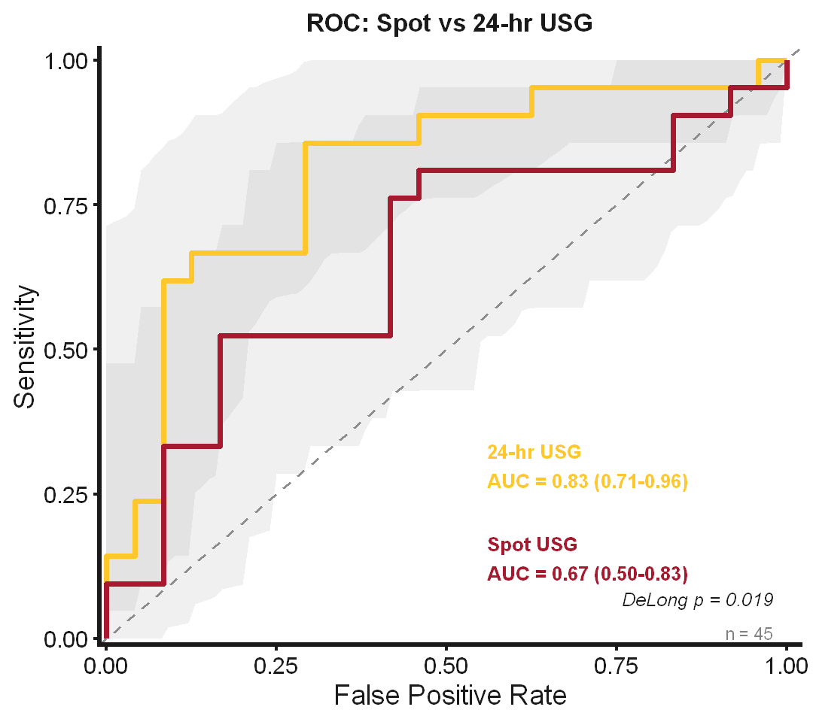

# AKI ROC Analysis

## Overview
This repository contains reproducible analyses evaluating the predictive performance of hydration markers for acute kidney injury (AKI) in young vs. older females.

The analysis focuses on diagnostic accuracy using ROC-based methods to compare biomarkers across age groups and conditions.

---

## Objectives

### Aim 1 — Between-Group Diagnostic Performance
Evaluate whether hydration markers differ in their ability to predict AKI risk between:
- Young females (YF)
- Older females (OF)

Metrics:
- Area Under the Curve (AUC)
- 95% Confidence Intervals
- Youden’s J index (optimal threshold)
- Unpaired DeLong test for group comparisons

---

### Aim 2 — Within-Subject Marker Comparison
Compare:
- Spot USG  
vs.  
- 24-hour USG  

Using:
- Paired ROC curves  
- Paired DeLong test  

---

### Table 1 — Participant Characteristics
Descriptive and inferential statistics for demographics:
- Median [IQR]
- Mann–Whitney U test
- Rank-biserial correlation effect size

---

## Repository Structure
├── aki_roc_analysis.ipynb # Main analysis notebook

├── .gitignore

├── README.md

---

## Data Requirements

Place the dataset in the root directory:

### Required Columns

- Age Group
- ID
- Condition
- IGFBP7*TIMP-2 ((ng/mL)^2)/1000
- AKI Risk
- percent change weight
- Spot USG
- 24hr USG
- 24hr Osmo
- Plasma Osmo
- Screening BMI
- Age

---

## Missing Data Handling

Participants missing AKI Risk:
- Excluded from ROC analyses  
- Included in demographic analyses  

The purpose was to preserve statistical validity while maximizing descriptive sample size.

---

## Methods Summary

### ROC Analysis
- Implemented using `pROC`
- AUC with DeLong confidence intervals
- Optimal thresholds via Youden’s J

### Statistical Testing
- Unpaired DeLong test → between-group comparisons  
- Paired DeLong test → within-subject comparisons  
- Mann–Whitney U test → demographic comparisons  

---

## Figures Generated

<table style="width:100%">
  <tr>
    <th style="text-align:center">Figure 1: AUC by Age Group</th>
    <th style="text-align:center">Figure 2: Paired ROC Analysis</th>
  </tr>
  <tr>
    <td></td>
    <td></td>
  </tr>
</table>
---

## Requirements

- R ≥ 4.0  
- Jupyter Notebook with IRkernel  

### R Packages
- pROC
- ggplot2
- dplyr
- zoo
- coin
- rstatix

---

## Quick Start

### 1. Clone the repository
```
git clone https://github.com/Jonathan-Hoch/aki-roc-analysis.git
```

### 2. Install dependencies
Run in R:

```r
source("requirements.R")
```

### 3. Add dataset
AKI_data.csv

### 4. Run analysis
Open and execute:
aki_roc_analysis.ipynb

Run all cells from top to bottom.

### Limitations
Small sample size limits statistical power
ROC comparisons may not detect modest differences
Findings should be interpreted as exploratory

### Notes
This repository does not include raw participant data

Ensure compliance with IRB and data-sharing policies before adding datasets
